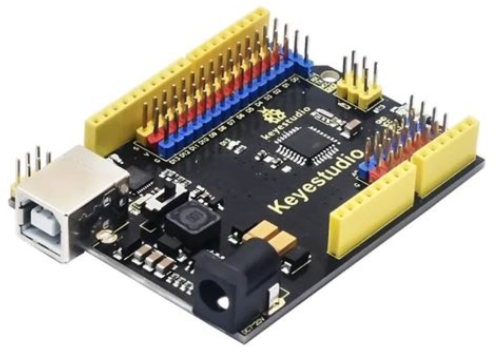
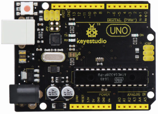

En esta web vamos a encontrar contenidos que resultarán útiles para para iniciarnos en la placa Keyestudio UNO, una versión desarrollada por [Keyestudio](https://www.keyestudio.com/) y distribuida para España por [INNOVA DIDACTIC](https://shop.innovadidactic.com/es/).

  

